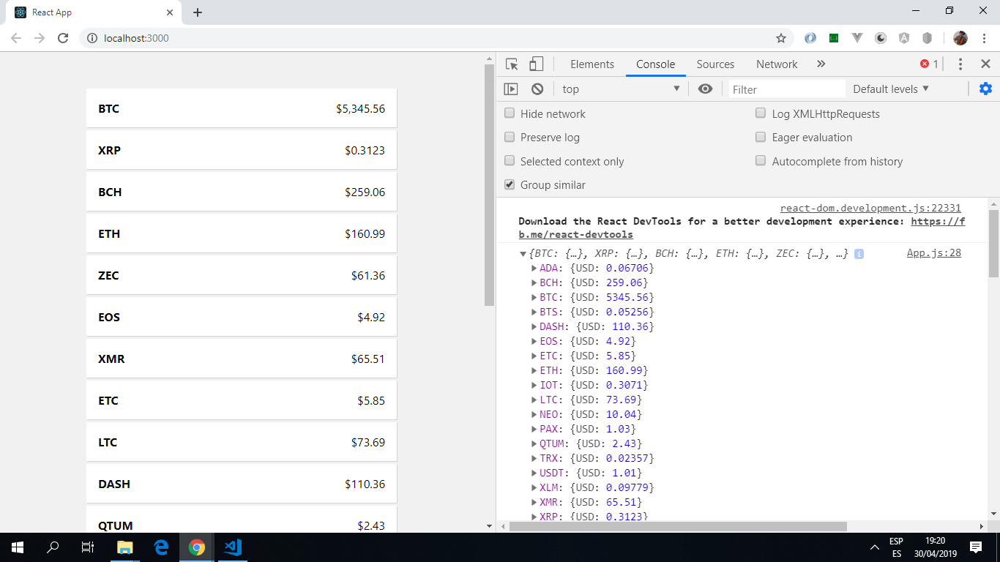

# React Crypto App

Creates a crypto currency app using React.

*** Note: to open web links in a new window use: _ctrl+click on link_**

## Table of contents

* [General info](#general-info)
* [Screenshots](#screenshots)
* [Technologies](#technologies)
* [Setup](#setup)
* [Features](#features)
* [Status](#status)
* [Inspiration](#inspiration)
* [Contact](#contact)

## General info

Lists prices of cryptocurrencies, depending on setup of API http request.

## Screenshots

.

## Technologies

* [Node.js v10.15.3](https://nodejs.org/) javascript runtime using the [Chrome V8 engine](https://v8.dev/).

* [React v16.8.6](https://reactjs.org/) Javascript library.

* [Axios v0.18.0](https://www.npmjs.com/package/axios) promise based HTTP client used to get crypto prices from axternal API.

## Setup

* `npm start` Runs the app in the development mode. Open [http://localhost:3000](http://localhost:3000) to view it in the browser.

* `npm run build` Builds the app for production to the `build` folder. It correctly bundles React in production mode and optimizes the build for the best performance. The build is minified and the filenames include the hashes.

## Code Examples

* extract of `App.js` - axios http asynchronous call to cryptocurrency API.

```javascript

/*
function will be carried out once app loads
axios is promise-based so then function used
cryptocompare returns price of 3 bitcoins compared to the US $.
*/
componentDidMount() {
	const fsymsList = 'BTC,XRP,BCH,ETH,ZEC,EOS,XMR,ETC,LTC,DASH,QTUM,NEO,XLM,TRX,ADA,BTS,USDT,XUC,PAX,IOT'
	axios
		.get('https://min-api.cryptocompare.com/data/pricemulti?fsyms=' + fsymsList + '&tsyms=USD')
    .then(res => {
      const cryptos = res.data;
      console.log(cryptos);
      this.setState({cryptos: cryptos});
    });
}

```

## Status & To-Do List

* Status: working app that gets api data. `The aarning '_Each child in a list should have a unique "key" prop_' needs to be corrected.

## Inspiration

* [Gary Simon of Coursetro: React CryptoCurrency Tutorial - Display Exchange Data with an API](https://www.youtube.com/watch?v=18DkUJ669kc&t=120s)

## Contact

Created by [ABateman](https://www.andrewbateman.org) - feel free to contact me!
